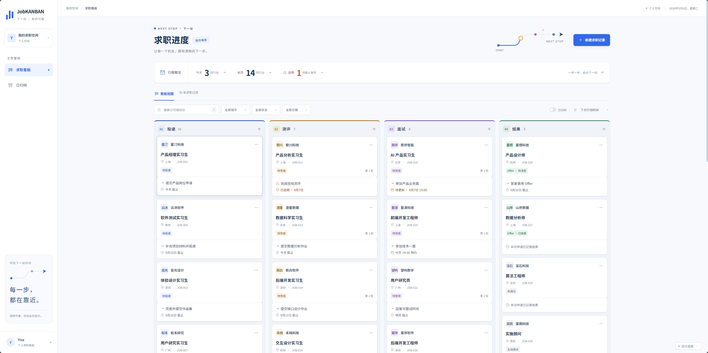
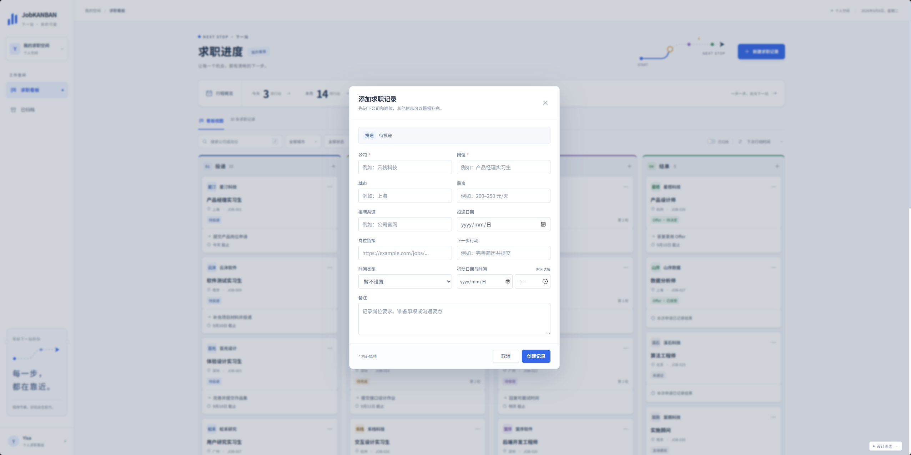
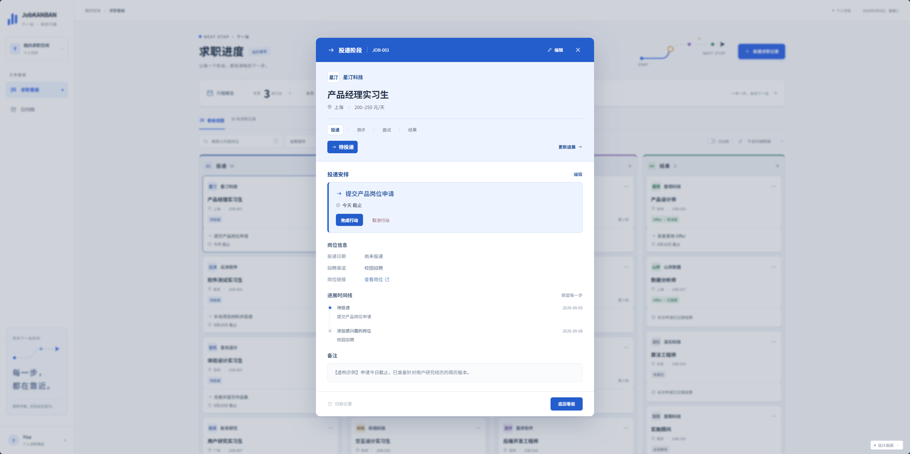
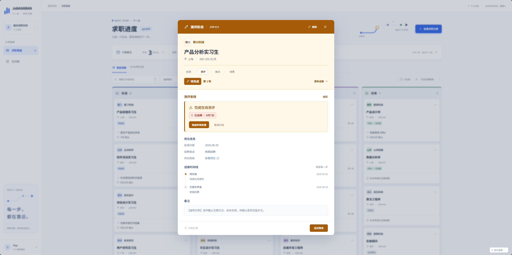
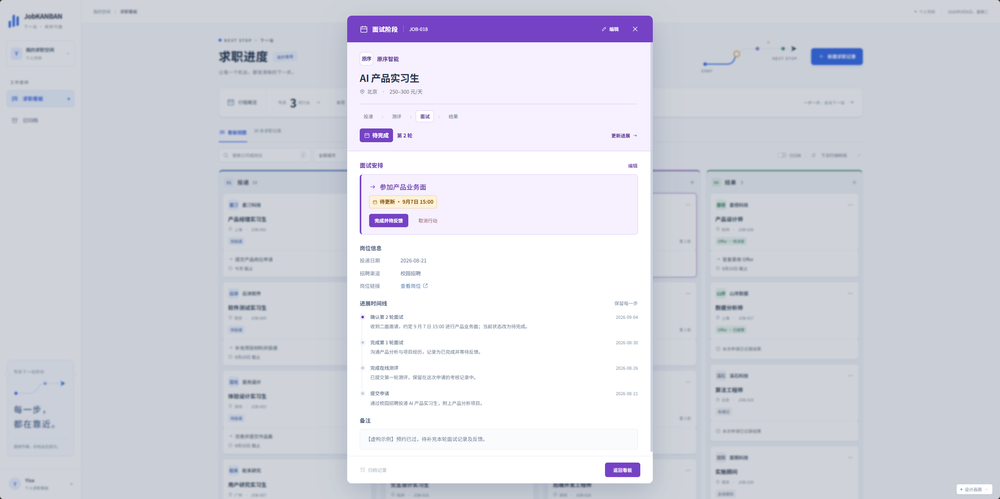
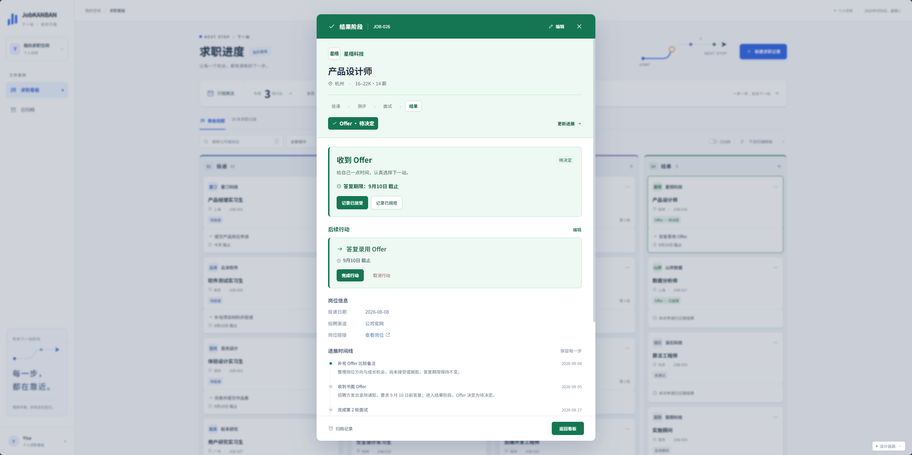

# JobKANBAN

一个本地优先的个人求职进度看板。用四个阶段管理从投递到结果的完整流程，并把下一步行动、截止时间、测评与面试轮次、Offer 决定和变更历史集中到一处。



> JobKANBAN 当前面向本机单用户使用：数据保存在本地 SQLite 数据库中，不需要账号，也不会自动上传到云端。首次启动是空看板，截图中的公司与岗位均为虚构示例。

## 功能

- 在投递、测评、面试、结果四个阶段之间管理求职记录
- 搜索、筛选、排序并拖动卡片更新阶段
- 记录测评和面试轮次、备注、结果及待反馈状态
- 设置截止日期、预约时间或无日期的下一步行动
- 标记 Offer 为待决定、已接受或已婉拒
- 归档和恢复记录，保留进展时间线
- 在多页面同时编辑时检测版本冲突，避免静默覆盖

## 本机部署

### 环境要求

- Node.js `24.14.0` 或更新的 **24.x** 版本
- npm（随 Node.js 安装）
- Windows 10/11 推荐；启动器也支持 macOS 和 Linux 命令行环境

### Windows 一键启动（推荐）

克隆或下载仓库后，进入项目根目录：

```powershell
git clone https://github.com/Ez-boi123/JobKANBAN.git
cd JobKANBAN
.\start.cmd
```

也可以直接双击 `start.cmd`。启动器会：

1. 检查 Node.js 版本；
2. 按 `app/package-lock.json` 在需要时执行 `npm ci`；
3. 在源码变化后重新构建前端；
4. 启动服务并打开 <http://127.0.0.1:3000>。

保持命令窗口运行；按 `Ctrl+C` 停止服务。若 JobKANBAN 已在运行，启动器会复用现有服务；若 3000 端口被其他程序占用，会给出错误提示。

### 命令行启动

在项目根目录执行：

```powershell
npm --prefix app run launch
```

需要手动控制安装、构建与启动时：

```powershell
npm --prefix app ci
npm --prefix app run build
npm --prefix app start
```

### 部署边界

正式服务只监听 `127.0.0.1:3000`，并包含本机 Host、Origin 与跨站请求校验。当前版本不提供登录、权限、多人协作、云存储、跨设备同步或远程访问，因此不支持直接部署到公网、Vercel、静态托管或局域网共享。

如果要改造成在线多用户服务，需要另行设计身份认证、授权、HTTPS、持久化存储、备份恢复、并发写入和安全审查；仅修改监听地址或做端口转发并不安全。

## 使用方法

### 1. 创建求职记录

点击右上角“新建求职记录”，先填写必填的公司和岗位，再按需补充城市、薪资、招聘渠道、岗位链接、投递日期、下一步行动和备注。



### 2. 跟进四个阶段

看板按照求职流程组织记录。点击卡片查看详情；拖动卡片后确认保存，或在详情中使用“更新进展”。

| 阶段 | 适合记录的内容                                 |
| ---- | ---------------------------------------------- |
| 投递 | 待投递、已投递，以及简历完善、网申等下一步行动 |
| 测评 | 在线测评、笔试轮次、截止日期、完成结果与待反馈 |
| 面试 | 多轮面试、预约时间、轮次备注、结果与待更新提醒 |
| 结果 | Offer 决定、未通过或主动退出，以及后续行动     |

<table>
  <tr>
    <td></td>
    <td></td>
  </tr>
  <tr>
    <td align="center">投递阶段：行动与进展时间线</td>
    <td align="center">测评阶段：轮次、截止时间与待反馈</td>
  </tr>
  <tr>
    <td></td>
    <td></td>
  </tr>
  <tr>
    <td align="center">面试阶段：预约、轮次与结果</td>
    <td align="center">结果阶段：Offer 决定与后续行动</td>
  </tr>
</table>

### 3. 完成行动并保留历史

- “完成行动”会清除当前行动，并在时间线中保留完成记录。
- 测评或面试可使用“完成并待反馈”，让卡片进入待反馈状态。
- “取消行动”只取消当前安排，不会丢失阶段、轮次或 Offer 信息。
- 结果阶段的记录可以归档；需要时从“已归档”恢复。

## 数据、备份与隐私

成功保存的数据默认写入：

```text
data/jobkanban.sqlite
```

数据不依赖浏览器缓存，刷新页面、换用本机浏览器或重启服务后仍可读取。`data/` 还可能包含运行日志，已被 `.gitignore` 排除，不会随仓库提交。

备份步骤：

1. 按 `Ctrl+C` 停止服务；
2. 复制整个 `data` 文件夹到安全位置；
3. 恢复时先停止服务，再用备份的 `data` 文件夹替换当前文件夹。

SQLite 文件可能包含公司、岗位、联系方式和面试备注等个人求职信息，请像保护个人文档一样妥善保管。当前版本不提供热备份、自动云备份或数据迁移工具。

## 开发

在项目根目录启动前后端开发环境：

```powershell
npm run dev:all
```

该命令会启动后端 `127.0.0.1:3000` 和 Vite 前端 `127.0.0.1:5173`，随后打开 <http://127.0.0.1:5173>。开发环境与正式入口默认使用同一个本地数据库；正式使用请仍选择 `start.cmd` 或 `npm --prefix app run launch`。

如需分别控制进程，请打开两个终端并分别运行：

```powershell
npm --prefix app start
npm --prefix app run dev
```

### 检查与测试

```powershell
npm --prefix app run typecheck
npm --prefix app run build
npm --prefix app test
npm --prefix app run test:browser
npm --prefix app run test:controls
```

浏览器测试会自行启动测试服务并使用临时数据库，不会触碰实际求职记录。Windows 默认使用已安装的 Edge；其他环境可在 `app` 目录安装 Chromium，并将 `PLAYWRIGHT_CHANNEL` 设为 `chromium`：

```powershell
cd app
npx playwright install chromium
$env:PLAYWRIGHT_CHANNEL = "chromium"
npm run test:browser
```

## 静态设计预览

`design/index.html` 是独立的静态界面预览，使用固定的虚构示例数据。预览中的操作不会写入正式数据库，刷新后会恢复示例状态。更多说明见 [design/README.md](design/README.md)。它不是在线演示站，也不等同于实际应用部署。

## 技术栈与目录

- React 19 + TypeScript
- Vite 7
- Node.js 原生 HTTP 服务
- Node.js 内置 SQLite
- Playwright 浏览器测试

```text
JobKANBAN/
├─ start.cmd          Windows 一键启动
├─ package.json       根目录开发命令
├─ app/               前端、后端、启动器与测试
│  ├─ src/            React 前端
│  ├─ server/         Node.js 后端与 SQLite 存储
│  ├─ scripts/        启动器
│  └─ tests/          自动化测试
├─ data/              本地数据库与日志（不会提交）
├─ design/            静态设计预览与导出素材
└─ docs/              产品、开发文档与 README 截图
```

`.scratch/`、`AGENTS.md`、`CONTEXT.md` 和 `docs/adr/` 属于开发者内部规格、任务与领域资料，普通用户无需阅读。

## License

Copyright © 2026 Haofeng。本项目使用 [MIT License](LICENSE)。
